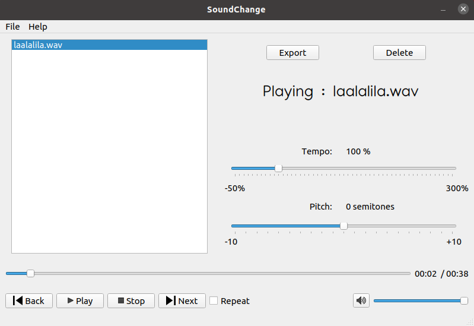

# SoundChange

Audio player implemented in Qt framework. It reads audio files in WAV and MP3 format. It can also change tempo and pitch of the audio and export it, but only for WAV files.

The player uses the SoundTouch library (v2.2) which is a C++ library that can apply audio effects (Make sure that SoundStretch is also installed). It is tested only in Ubuntu 20.04 .

